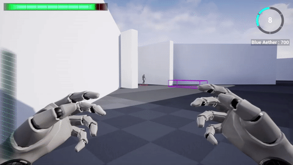

# Aether Forge

Hello and Welcome to the source code repository for my game, Aether Forge! ..Which currently operates under the repository Control_Alt_Delete.  I've worked on for a little over 4 years now, is solo developed, and my first attempt at utilizing the Unreal Engine.  The Project is coded almost entirely in c++, utilizing UE's visual scripting language blueprints as modular data-only graphs for default data manipulation and asset managment.  It's from this framework I've been able to build a scalable, modular codebase that allows easy tuning and addition to the project. 

At its core, Aether Forge is an ambitious multiplayer RTS / FPS Hybrid with RPG Elements.  Players will play in teams either as an all seeing oracle (RTS) or one of potentially multiple commander (FPS) units.  The core ideology behind Aether Forge is that while both play types can ultimately do each others job individually, teamwork and cooporation will yield the highest reward.

## PreGame Systems
### Main Menu
The Main Menu offers a flexible set of offline widgets implemented in C++ amd designed in UMG giving the player conroller over most local settings.  It's also responisble for finding available online sessions via the OnlineSubsystem.  Currently supports Steam and LAN Connection Types. 

#### Server Hosting
Servers may be hosted as private or public, both are searchable over the session interface, but private games have an embedded password specified by the host.

#### Server Joining
Lists the available hosted servers, 

#### Future Features
1. Options Menu
2. Epic Games Session Support
3. Join Private Games Via Password

### Lobby System
Upon Joining the Session via the Online Subsystem Session the player is able to access a game agnostic lobby. This lobby was written for reuse for any lobby based online game and not actually tied to .  The server transition between the lobby and the game uses non-seamless travel, and stores server data in the game instance.  The recieving level needs to inherit a few top level architectural classes to ensure proper setup.  

#### Lobby Slots
Each Slot contains embedded data that gets associated with the player's unique net ID, by default this is just the associated team ID.  In the Case of the Aether Forge, the slot is overridden to designate the players RTS or FPS status in the game.

#### Future Features

## Game Systems
### RTS Systems
#### Camera
The RTS Camera provides a strategic view of the map, providing line of sight and awareness for the rest of the team.  It provides basic pan and zoom functionality with the keyboard.

Future Features
1. Camera Rotation 
2. Camera Edge Scrolling with the mouse.

#### Selection
The RTS Player is able to select units via the mouse in one of three formats 
1. Single Selection
2. Box Group Selection
3. Multi Unit Select

##### Selection Pane
Unit selections are captured in the unit selection pane, which provides quick access to currently selectable units.

### FPS Systems

#### Combat System

### Shared Systems
#### Skill System
Both playtype utilizes skill trees as means of progressing either themselves individually or the team globally.  The primary goal of the codebase is to make adding upgrades to the game as simple as possible while being able to effect a variety of object. In order to achieve this, an upgradable interface was contructed, allowing modification of gameplay objects in an easy and controllable manner.  One need only create a single class, implement what the upgrade does, and specify a target class or classes for the upgrade to effect.  Even the UI and associated tooltip are generalized to make additions to the game as simple as possible.   

#### Resource System

